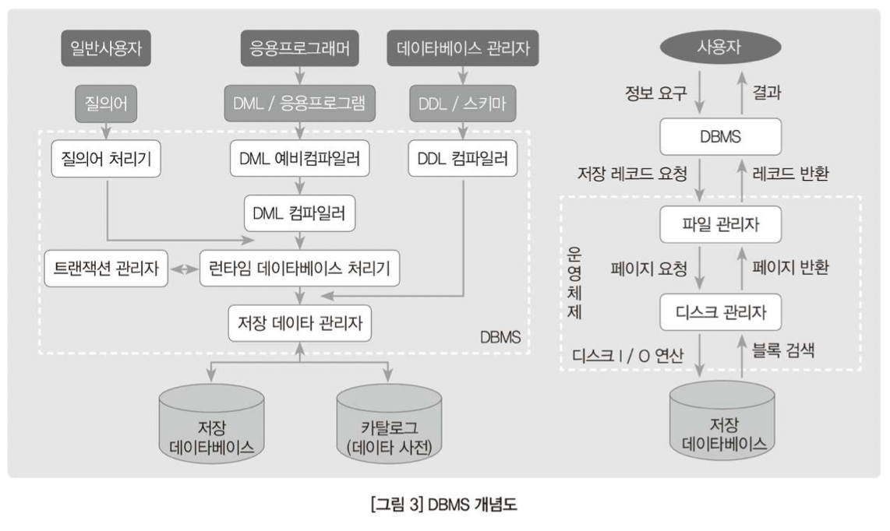
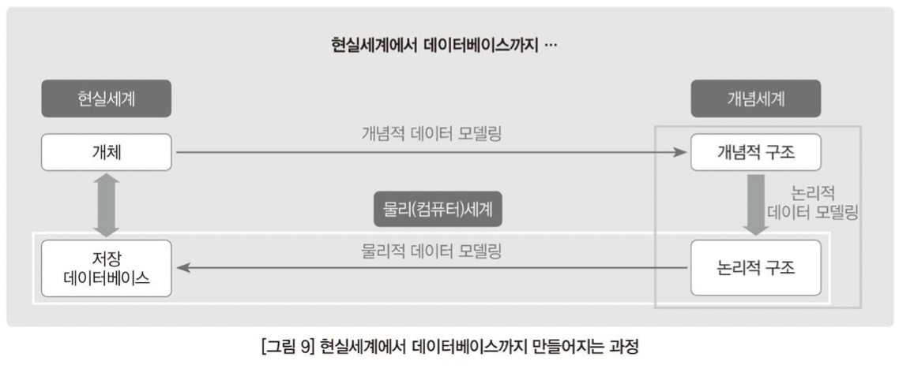
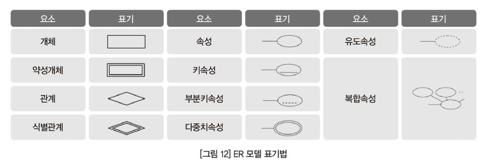
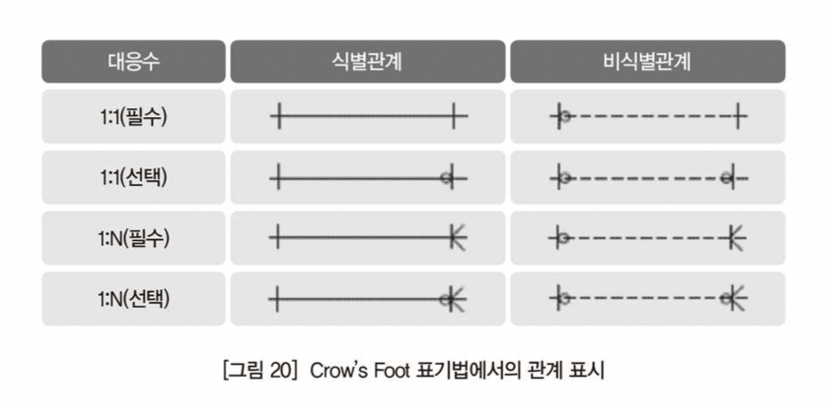
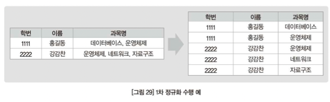
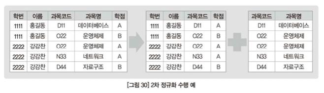
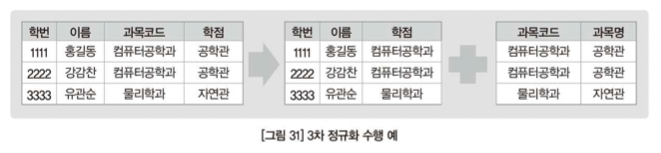
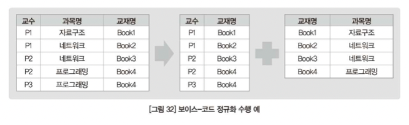

## 목차

- [데이터와 데이터베이스의 이해](#데이터와-데이터베이스의-이해)
- [데이터베이스 종류 이해](#데이터베이스-종류-이해)
- [데이터베이스 설계 및 구축절차](#데이터베이스-설계-및-구축절차)
- [데이터 모델링](#데이터-모델링)
- [정규화와 반정규화](#정규화와-반정규화)
- [데이터베이스 물리설계](#데이터베이스-물리설계)
- [데이터베이스 품질과 표준화](#데이터베이스-품질과-표준화)
- [관계 데이터베이스 언어](#관계-데이터베이스-언어)
- [동시성제어](#동시성제어)
- [데이터베이스 복구](#데이터베이스-복구)
- [데이터베이스 분석 이해](#데이터베이스-분석-이해)
- [빅데이터 및 NoSQL에 대한 이해](#빅데이터-및-NoSQL에-대한-이해)
- [인공지능 이해](#인공지능-이해)

# 데이터와 데이터베이스의 이해

## 데이터의 이해

### 데이터

현실게계에서 발견, 조사, 수집, 창작을 통한 기초자료의 수집 자원의 형태 그대로인 것. 인간의 가치와 판단이 들어가 있지 않은 상태로, 자연 상태 그대로를 뜻하는 사실과 관련이 됨.

### 정보

다양한 데이터를 목적에 맞게 일정한 규칙에 따라 정리하고 분류하여 체계화한 형태. 데이터를 일정한 양식으로 처리, 가공하면 특정 목적을 달성하는데 필요한 정보가 생상됨

### 지식

수많은 구체화된 정보로부터 일반화된 사항. 정보화된 데이터의 의미와 관계를 해석 및 연구하는 과정에서 생산됨. 정보가 지식이 되기 위해서는 정보간의 연관성이 설정되어야 하므로, 정보화된 데이터의 의미 부여와 관계의 해석, 인간의 가치와 판단에 따라 매우 다양할 수 있음. 기업과 기관에서는 의사결정이나 부가가치 창출을 목적으로 이러한 정보나 지식을 관리.

## 데이터베이스의 이해

### 파일처리시스템

#### 1. 파일처리시스템의 특징

- 프로그래머가 생각하는 논리적 파일 구조를 직접 물리적 파일 구조로 구현
- 물리적 데이터구조를 알고 있어야만 접근 방법을 응용 프로그램 속에 구현
- 각자의 데이터 파일을 가지고 있는 환경하에 데이터의 공용은 어렵게 되어 하나의 파일은 하나의 응용만을 위해 존재

#### 2. 파일처리시스템의 문제

- 데이터 독립성 보장 미흡 - 프로그램에 의존적
- 데이터 일관성 보장 문제 - 파일의 시간 의존성
- 데이터 무결성 보장 문제 - 의미적으로 같은 값은 동일하게 유지
- 공유성, 사용 편의성 저조 - 낮은 경제성, 보안관리 저조

### 데이터베이스

#### 1. 데이터베이스의 특징

- 데이터베이스는 통합, 운영, 저장, 공유되는 특징을 가짐
- 종이 등에 기록할 때는 동일한 데이터라도 실시간 공유가 한정적이라 데이터가 중복 저장됨
- 데이터베이스는 중복된 데이터를 한 군데 집약시켜 중복을 배제
- 분류
  - 통합 데이터 : 동일한 데이터가 원칙적으로 중복되어 있지 않음
  - 저장 데이터 : 컴퓨터가 접근 가능한 저장 매체에 저장
  - 운영 데이터 : 한 조직의 고유 기능을 수행
  - 공용 데이터 : 한 조직의 여러 응용 프로그램이 공동을 소유, 유지, 이용

#### 2. 데이터베이스의 문제

- 데이터베이스는 프로그래밍 언어를 통해 실시간 접근이 가능
- 입력, 수정, 삭제를 통해 지속적으로 변화
- 여러명의 사용자가 동시에 접근하여 사용이 가능
- 특징
  - 실시간 접근성 : 수시적이고 비정형적인 Query에 대하여 실시간 응답
  - 계속적인 변화 : 갱신, 삽입, 삭제 및 동적
  - 동시 공용 : 동일 데이터를 여러 사람이 다른 방법으로 동시에 공용 할 수 있음
  - 내용에 의한 참조 : 위치나 주소가 아닌, 사용자가 요구하는 데이터의 내용, 값에 의한 참조

## 데이터베이스 시스템의 이해

### 데이터베이스 시스템(DBS)의 구성요소

- 데이터베이스 : 한 조직의 여러 응용 시스템이 공용하기 위해 최소의 중복으로 통합, 저장된 운영 데이터의 집합
- 데이터베이스 언어(Database Language) : 사람과 시스템의 인터페이스를 제공하는 도구
- 사용자 : 데이터베이스 관리자(DBA), 데이터베이스 응용 프로그래머, 데이터베이스 사용자
- 데이터베이스 관리시스템(DBMS) : 데이터베이스를 구축하고 이용하는 기능을 제공하는 시스템 소프트웨어

### 데이터독립성과 ANSI-SPARC의 3-Level Database Architecture

#### 1. 3-Level Database Architecture

- 외부스키마 (External Schema)

  - View 단계 여러 개의 사용자 관점으로 구성
  - 개개인의 사용자 단계로서 개개 사용자가 보는 개인적 DB 스키마
  - DB의 개개 사용자나 응용 프로그래머가 접근하는 DB 정의
  - 사용자 관점으로 접근하는 특성에 따른 스키마 구성

- 개념 스키마 (Conceptual Schema)

  - 개념단계 하나의 개념적 스키마로 구성
  - 모든 사용자 관점을 통합한 조직 전체의 DB
  - 모든 응용 시스템들이나 사용자들이 필요로 하는 데이터를 통합한 조직 전체의 DB
  - DB에 저장되는 Data와 관계를 표현
  - 통합 관점에서의 Schema

- 내부 스키마(Internal Schema)
  - 내부 스키마로 구성된 DB가 물리적으로 저장된 방식
  - 물리적 장치에서 Data가 실제로 저장되는 방법을 표현하는 스키마

#### 2. 데이터 독립성

- 논리적 독립성

  - 개념 스키마가 변경되어도 외부 스키마에는 영향을 미치지 않도록 지원
  - 논리적 구조가 변경되어도 응용 프로그램에 영향이 없음
  - 사용자 특성에 맞는 변경 및 통합 구조의 변경 가능

- 물리적 독립성
  - 내부 스키마가 변경되어도, 외부/개념 스키마는 영향을 받지 않도록 지원
  - 저장장치의 구조변경은 응용 프로그램과 개념 스키마에 영향이 없음
  - 개념구조의 영향 없이 물리적인 구조변경이 가능

#### 3. 사상(Mapping)

- 외부적/개념적 사상 (논리적)

  - 외부적 View와 개념적 View의 상호 관련성
  - 사용자가 접근하는 형식에 따라 다른 타입의 필드를 가질 수 있음
  - 개념적 View의 필드 타입은 변화 없음

- 개념적/내부적 사상 (물리적)
  - 개념적 View와 저장된 데이터베이스의 상호관련성
  - 저장된 데이터베이스 구조가 변경되면, 개념적/내부적 사상이 바뀌어야함

### 데이터베이스 관리자(DBA) 와 데이터아키텍트(DA)

#### 1. 데이터베이스 관리자(DBA)

> 데이터베이스 시스템의 원할한 기능을 수행하기 위하여 데이터베이스 구성 및 운영 전반에 대한 책임을 지님

- 데이터 모델링 : 프로젝트 수행 시 분석/설계에 물리 모델로 역할
- DB 물리설계 : 물리적 공간 환경, 서버, DBMS에 따른 물리적 설계 진행
- 튜닝 : 튜너 역할
- DB 구축
- DB 운영
- DB 표준화

#### 2. 데이터아키텍트(DA)

> 데이터와 관련된 요소(데이터, 데이터베이스, 데이터표준, 데이터보안)에 대한 정책 및 기준을 수립하여 모델링 및 체계화

- 데이터 관리체계수립
- 데이터 표준 수립
- 데이터 모델링 수행
- 데이터 보안체계 수립

### DBMS(Database Management System)

> 파일시스템의 문제점인 종속성과 중복성의 문제를 해결하고자 고안된 시스템

#### 1. DBMS의 기능

- 다 사용자 간의 데이터 공유
- 권한 없는 사용자의 데이터 접근 통제
- 다양한 사용자에게 다양한 형태의 인터페이스 제공
- 데이터 사이에 존재하는 복잡한 관련성을 표현
- 데이터베이스의 무결성을 보장

#### 2. DBMS의 구성요소

- DDL 컴파일러 : DDL로 명세된 스키마를 내부형태 즉, 메타데이터로 처리하여 시스템 카탈로그에 저장
- 질의어 처리기 : 일반 사용자가 제출한 고급 질의문을 처리
- DML 예비 컴파일러 : 응용 프로그램에 삽입된 DML 명령문을 추출 후 목적코드로 컴파일 되도록 DML 컴파일러에 전송
- DML 컴파일러 : 넘겨받은 DML 명령어를 파싱 및 컴파일 하여 목적 코드를 생산
- 런타임 데이터베이스 처리기 : 실행시간에 데이터베이스 접근을 관리
- 트랜잭션 관리자 : 데이터베이스에 접근하는 과정에서 무결성 제약조건의 만족여부 등 체크
- 저장 데이터관리자 : 디스크에 저장되어 있는 사용자 데이터베이스나 카탈로그 접근을 책임

# 데이터베이스 종류 이해

## 주요 데이터베이스 유형

### 계층형 데이터베이스

> 데이터를 상하 종속적인 관계의 트리 형태로 계층적으로 저장하는 데이터베이스로 액세스 속도가 빠르고 데이터 사용량을 쉽게 예측할 수 있지만, 변화하는 업무 프로세스에 대한 적응이 쉽지 않음

- 계층 구조로 이루어진 가장 오래된 데이터베이스 (1960년대)
- 각 계층 구조는 물리적인 포인터로 연결되어, 서로 종속적인 관계 유지
- 초기 구축 후 업무 프로세스 변경에 따른 데이터 구조 변경이 어려움
- 예상치 못한 무작위 검색이 어려움

### 네트워크형 데이터베이스

> 게층형 데이터베이스의 트리 형태를 망 형태로 확장하여 데이터를 저장하며, 레코드 사이에 다대다 관계를 유지하고 데이터 연결을 위하여 포인터를 사용

- 계층형 데이터베이스의 문제점 해결을 위해 1970년대 초 개발
- 계층 구조 간 연결 고리를 추가하여 빠르고 효과적인 데이터 추출 가능
- 복잡한 형태의 시스템에는 많은 유지보수 및 백로그 필요
- 프로그래머가 구조를 이해해야만 프로그램이 작성 가능
- 부모 레코드들에 대한 포인터를 가질 수 있음

#### 1. 관계형 데이터베이스(RDB)

> Oracle, SQL Server, DB2, Informix, 등 존재

- 모델 자체가 2차원 구조로 간단함
- 수학적 이론의 바탕 위에 성립됨
- 질의어가 존재
- 시대적 상황에 부응하는 기술의 지원 (C/S, 대규모 병렬처리 ...)

#### 2. 객체 지향 데이터베이스(OODB)

> 비정형 복합 정보 처리 문제를 해결

- 사용자정의 데이터타입의 지원 및 상속성 명세가 가능
- 프로그램 내 정보 구조와 데이터베이스 스키마 구조가 유사

## 객체관계 데이터베이스

> 관계 데이터베이스의 취약점을 해결하기 위해 등장한 객체 지향형 데이터베이스를 확장시킨 객체관계형 데이터베이스로, Oracle9i, SQL Server 등 존재

- 사용자정의 데이터타입 지원 : 사용자가 직접 데이터 타입을 정의 및 사용 가능
- 참조타입 지원 : 하나의 객체 레코드가 다른 객체 레코드를 참조하여 참조 구조의 네비게이션 기반 데이터 접근이 가능
- 중첩된 테이블 지원 : 테이블 안의 하나의 칼럼이 또 다른 테이블로 구성 가능
- 대단위 객체 지원 : 이미지, 오디오, 비디오 등 비정형 데이트를 기본 데이터타입으로 지원
- 테이블 상속 관계 지원 : 테이블 간 상속 관계를 지정하여 객체 지향 데이터베이스의 장점을 수용

## XML

> 웹 환경에서 데이터를 구조화하고 교환하기 위해 표준으로 개발한 확장 가능한 마크업

### XML의 특징

- 단순성 : SGML의 관략화
- 개방성 : Web에서 사용 가능하며, 메타데이터를 주고받음
- 확장성 : 자신만의 태그 생성 가능
- 사람과 기계가 모두 이해할 수 있음
- 내용과 표현의 분리
- 게층적 구조
- 유니코드

### XML의 구성

- XML DTD(Document Type Definition)
  - XML 문서의 형태를 일관된 구조로 정의하는 문서로, 유효성 검증으로 사용됨
- XML Schema
  - XML DTD보다 복잡한 데이터타입의 선언이 가능
- XPath
  - 경로식에 탐색 조건을 수용할 수 있도록 확장하여 질의어를 표현
- XQuery
  - XML 표준 질의어로, 파일에서 데이터베이스를 사용하는 것과 같이 정보를 추출
- XSL(Extensible Stylesheet Language)
  - XML 데이터를 여러 가지 상이한 형태로 표현하기 위한 스타일시트를 명세
- XSLT(Extensible Stylesheet Language Transformation)
  - XSL의 일부로, XML 문서를 다른 일반 브라우저도 디스플레이 할 수 있도록 다른 유형의 문서로 변환
- XLL(eXtensible Linking Language)
  - XLink : HyperLink와 같은 인식의 처리
  - XPointer : XML 문서내의 요소에 대한 주소

## 다양한 데이터베이스 종류

### 멀티미디어 데이터베이스

> 대용량과 복잡성을 가진 텍스트, 이미지, 오디오, 비디오 등 멀티미디어 비정형 자료를 효율적으로 검색 및 관리하고자 개발된 데이터베이스

#### 1. 메인 메모리 데이터베이스(MMDB)

> 데이터베이스를 메모리에 상줏키면서 관리 및 운영하는 데이터베이스

- 모든 연산을 메인 메모리에서 수행하여 디스크 I/O를 발생시키지 않음
- 디스크 기반 데이터베이스의 성능 저해 원인인 디스크 I/O를 줄임
- 메인 메모리의 휘발성으로 하드웨어 기반의 오류 회복
- 백업 및 로그 생성을 위하여 디스크 사용
- Hashing 및 T-Tree 인덱싱 사용

#### 2. 임베디드 데이터베이스(Embedded DB)

> 임베디드 환경에서 특정 기능을 구현하기 위해 사용됨

- 최소한의 RAM 및 Disk를 사용하도록 Overhead를 줄임
- 중앙 서버의 DB와의 통신 등을 위하여 서로 다른 Device간 통신을 지원
- 임베디드 시스템의 다양한 플랫폼에 포팅될 수 있는 이식성 제공
- 실시간 OS 성능 조건 만족

#### 3. 모바일 데이터베이스

> 현장 업무에서 발생한 데이터를 가공 후 동기화를 위하여 중앙 서버로 전송하는 기능을 이용

- 플랫폼 및 OS에 독립적
- 장애에 대한 복구가 신속하며 한정된 환경에서 최적화됨
- 제한된 CPU와 메모리를 제공하는 장비에 탑재

#### 4. 공간 데이터베이스

> 공간 객체의 좌표 값으로 표현되는 공간 데이터의 집합

- 지리객체인 기하와 객체 공간관계에 대한 위상을 포함
- 공간적인 특성을 반영

#### 5. 칼럼형 데이터베이스

> 칼럼형으로 정렬한 데이터베이스

- 칼럼마다 중복된 값이 많을 경우 압축 효율이 좋음
- 분석용 RDBMS (Vectorwise, Sybase IQ)등에서 사용

# 데이터베이스 설계 및 구축절차

## 데이터베이스 설계 및 구축 과정

> 일반적으로 요구사항 수집 및 분석 -> DB 설계 -> DB 구축 -> 운영 및 유지보수로 이루어진다

### 요구사항 수집 및 분석

1. 사용자가 요구하는 업무 요구사항을 수집 및 분석
2. 단계 산출물로 요구 조건 명세서를 작성
3. 정적 구조 요구사항 및 동적 구조 요구사항을 파악

- 정적 구조 요구사항 : 엔티티, 속성, 관계, 제약조건 등
- 동적 구조 요구사항 : 트랜잭션의 유형, 빈도 등

### DB 설계

> 개념적 데이터 모델, 논리적 데이터 모델, 물리적 데이터 모델로 분류된다

- 개념적 데이터 모델링
  - 추상화 수준이 높음
  - 업무 중심적임
  - 포괄적인 수준의 모델링 진행
  - 전시적 데이터 모델링
  - 엔티티의 식별자, 관계, 등으로 도출됨
  - ER 모델로 표현
- 논리적 데이터 모델링
  - 시스템으로 구축하고자 하는 업무에 대하여 Key, 속성, 관계 등을 정확하게 표현
  - 데이터 모델 재사용성이 높음
  - 이해를 위한 개념적 설계를 데이터베이스 저장이 용이한 논리적 구조로 변환
  - 관계형 모델인 경우, 테이블명, 기본키, 외래키 등이 결정
  - 요구수준에 맞춘 정규화가 수행됨
- 물리적 데이터 모델링
  - 실제로 데이터베이스에 이식할 수 있도록 성능 향상 및 저장의 효율화를 고려하며 설계
  - 물리 스키마가 도출됨

### DB 구축

- DB 구현 및 개발
- SQL문을 작성하고 실행하여 요구사항을 수용할 수 있는 DB 생산
- 구축해야할 데이터를 수집 및 가공
- 수집 가공된 데이터를 입력 및 저장

### 운영 및 유지보수

- 데이터베이스 품질 관리 및 모니터링
- 데이터베이스 복구 및 회복에 대한 전략 수립
- 보안 정책 수립
- 지속적인 유지보수 및 사후평가

## 데이터베이스 설계 고려사항

> 명확한 정리와 산출물이 작성되어야 문제가 발생할 가능성을 최소화 할 수 있음

- 개념 모델 설계 단계 고려사항
  - 데이터에 대한 의미와 데이터들 간의 상호관계에 대한 규칙을 정의
  - 주제영역, 핵심 엔티티, 관계가 정의되어 개념 데이터 모델이 산출물로 작성되어야함
- 논리 모델 설계 단계 고려사항
  - 개념 데이터 모델을 기반으로 속성과 키가 정의
  - 최종적으로 ERD 이 작성되어야함
- 물리 모델 설계 단계 고려사항
  - 물리적인 스키마를 구현하는 단계
  - 반정규화가 수행될 수 있으며, 여러 요건이 반영된 테이블 정의서가 도출

# 데이터 모델링

## 데이터 모델링의 개념 및 절차

- 추상화 : 현실 세계를 일정한 형식에 맞추어 표현
- 단순화 : 현실 세계를 약속된 규약이나 제한된 표기법과 언어로 표현
- 명확화 : 누구나 이해하기 쉽도록 모호함을 제거하고 정확하게 현상을 기술

> DB 설계의 순서는 개념 모델링 -> 논리 모델링 -> 물리 모델링 순서로 이루어진다

## 데이터 모델링의 절차

### 개념적 모델링

- 현실 세계에서 나타나는 정보 구조를 추상적으로 개념화하여 나타내는 단계
- 개념 모델링은 조직, 사용자의 데이터 요구사항을 분석하고 찾는 것에서 시작
- 핵심 엔티티와 그들 간의 관계를 발견하는 것이 제일 중요함

### 논리적 모델링

- 사람의 이해를 위한 개념적 설계의 결과를 데이터베이스에 저장하는 논리적 구조로 변환
- 효율적으로 저장하기 위한 정규화가 수행
- 관계형 모델이 사용되어, 개념적 모델링의 산출물인 ERD를 테이블 구조도로 변환하는 작업이 이루어짐

### 물리적 모델링

- 논리적 데이터 모델링이 데이터 저장소로서 어떻게 하드웨어에 표현될 것인가를 다루는 과정

## ER 표기법

> 학교에서는 주로 Chen의 모델 표기법을 통해 배우고 있다

- Chen
- IDEF1X
- Min-Max / ISo
- UML
- Case \* Method

## Chen 모형기반의 ER 표기법

### 엔티티

- 실세계에 존재하는 의미 있는 하나의 정보 단위
- 물리적 객체 뿐 아닌 개념적 객체도 포함
- 엔티티는 자체 식별자를 가지며, 사각형으로 표현
- 자체 식별자를 갖지 않는 엔티티를 약성 엔티티(Weak Entity)라 부르며 두줄 사각형으로 표현

### 관계

- 엔티티들 사이의 연관성으로 마름모로 표시
- 관계의 차수는 엔티티와 관계 사이에 작성하며 참여하는 엔티티의 수를 나타냄 (ex, 1:1, 1:N ..)

### 속성

- 엔티티 또는 관계의 본질을 나타내며 타원으로 표시
- 식별자
  - 속성명에 밑줄을 그어 표시
  - 모든 엔티티 집합에서 유일한 값을 갖는 속성 또는 속성 집합
  - 여러 속성이 합쳐져 식발자가 되는 경우, 해당 속성들을 조합하여 복합속성으로 만든 후 밑줄로 표시
- 다중치 속성
  - 여러 값을 동시에 가질 수 있는 속성
  - 두 줄 타원으로 표시
- 유도 속성
  - 저장된 데이터로부터 유도 가능한 속성
  - 점선 타원으로 표시
- 복합 속성
  - 둘 이상의 요솔 분해 가능한 속성
  - 링크로 표시

## 확장 ER 모델

### 일반화/특수화

- 일반화 : 하나의 엔티티 타입을 다수의 하위레벨 엔티티 타입으로 분리
- 특수화 : 다수의 엔티티 타입을 하나의 상위 레벨 엔티티 타입으로 통합
- IS-A 관계이며 상속 개념이 적용됨

### 집단화

- 여러 엔티티의 집합으로 새로운 엔티티를 정의
- IS-PART-OF 관계이며 상속 개념이 적용되지 않음

## Crow's Foot Model

> 산업계에서 정보공학 표기법으로 사용됨

### 관계

- 기준 엔티티를 한 개 또는 각으로 읽음
- 대상 엔티티의 관계참여도 즉 개수를 읽음
- 관계선택사양과 관계명을 읽음

### 식별자의 특징

> `주식별자`인지 `외부식별자`인지 등에 따라 특성에 차이가 있음

**주식별자의 특징**

- 유일성 : 주식별자에 의해 엔티티내에 모든 인스턴스들을 유일하게 구분
- 최소성 : 주식별자를 구성하는 속성의 수는 유일성을 만족하는 최수의 수
- 불변성 : 주식별자가 한 번 특정 엔티티에 지정되면 그 식별자의 값은 변하지 않아야 함
- 존재성 : 주식별자가 지정되면 반드시 데이터 값이 존재

### 식별자의 분류

- 대표성여부
  - 주식별자 : 엔티티 내에서 각 어커런스를 구분할 수 있는 구분자이며, 참조관계를 연결 할 수 있음
  - 보조식ㅂ려자 : 엔티티 내에서 각 어커런스를 구분 할 수 있으나, 대표성을 가지지 못하여 참조 관계 연결을 못함
- 스스로 생성 여부
  - 내부식별자 : 엔티티 내부에서 스스로 만들어지는 식별자
  - 외부식별자 : 타 엔티티와의 관계를 통해 타 엔티티로부터 받아오는 식별자
- 속성의 수
  - 단일식별자 : 하나의 속성으로 구성된 식별자
  - 복합식별자: 둘 이상의 속성으로 구성된 식별자
- 대체 여부
  - 본질식별자 : 업무에 의해 만들어지는 식별자
  - 인조식별자 : 업무적으로 만들어지지는 않지만, 원조식별자가 복잡한 구성이기에 인위적으로 만든 식별자

### 식별자관계와 비식별자관계

> 외부식별자는 자기 자신의 엔티티에서 필요한 속성이 아닌 다른 엔티티와의 관계를 통해 자식의 엔티티에 생성되는 속성을 외부식별자라 함(FOREIGN KEY).

### 슈퍼타입과 서브타입

- 배타적 서브타입 : 슈퍼타입은 최대 하나의 서브타입과 연결된다
- 포괄적 서브타입 : 슈퍼타입은 둘 이상의 서브타입과 연결된다

## 연결함정

### 부채꼴 함정

> A와 B가 N:1, B와C가 1:N 관계에서 발생한다

### 균열 함정

> 필수관계가 아닌 선택관계가 존재할 때 정보의 흐름이 끊겨 원하는 정보를 찾을 수 없음

## 객체-관계 매핑

### 클래스의 변환

- 각 클래스를 테이블에 대응
- 클래스의 인스턴스 객체는 테이블의 레코드에 대응
- 클래스의 속성은 테이블의 열에 대응
- 클래스의 연산은 별도로 대응되는 요소 없이 응용프로그램에서 구현

### 클래스 관계의 관계형 관계로의 변환

- 연관관계
  - 1:M : 1쪽의 기본키를 M의 외래키로 대응
  - 1:1 : 접근 빈도가 적은 쪽의 기본키를 많은 쪽의 외래키로 대응시키거나 두 클래스를 하나로 합침
  - M:N : 관계에 해당되는 새로운 클래스 생성
- 집약 관계
  - 외래키를 사용하여 해당 테이블을 참조
- 합성 관계
  - 제약조건으로 구현
- 일반화
  - Super 클래스와 각 Sub 클래스를 별도의 테이블로 매핑
  - Super 클래스가 SUb 클래스의 모든 속성을 가짐
  - Sub 클래스가 Super 클래스의 속성을 가짐

## 무결성과 키

### 무결성

- 영역 무결성 : 테이블에 존재하는 필드의 무결성을 보장하며, 타입등을 정의할 수 있으며 속성값은 원자성을 가진다
- 키 무결성 : 테이블의 모든 레코드는 식별 가능해야 한다
- 엔티티 무결성 : 모든 테이블은 기본키가 존재해야하며 각 기본키는 유일값을 가지고 Null이 아니어야 한다
- 참조 무결성 : 참조 관계에 있는 두 테이블의 데이터가 일정된 값을 가지도록 유지되어야 하며, 외래키는 Null 혹은 참조하는 테이블의 기본키에 존재해야 하며, 기본키가 참조될 경우 데이터의 삭제 또는 변경이 불가능하다

### 키

- 수퍼키 : 테이블 내의 필드 전체의 부분집합으로, 레코드를 유일하게 식별해 낼 수 있는 속성
- 후보키 : 기본키가 될 수 있는 후보이며, 유일성과 최소성을 만족
- 기본키 : 테이블에 특정 레코드를 구별하기 위해 후보키 중 선택된 고유한 식별자
- 외래키 : 다른 테이블을 참조할 때, 유일하게 식별가능하기 위한 키

# 정규화와 반정규화

## 정규화와 이상현상

> 속성간 종속성에 대한 고려 없이 설계된 경우 발생할 수 있는 이상현상

### 삽입 이상

> 삽입할 때 원하지 않는 정보까지 삽입 해야되는 경우

### 삭제 이상

> 삭제할 때 필요한 정보까지 삭제되어야 하는 현상

### 수정 이상

> 수정할 때 동일한 내용을 여러 건의 데이터에서 반복 수정해야 하는 현상

## 함수 종속성의 개념과 추론

### 함수 종속성

> 테이블에서 정의된 필드들의 부분집합 X,Y 에서 임의의 레코드쌍 t1, t1의 X값이 동일하면 항상 두 레코드의 Y값도 동일하다면, Y가 X에 종속 (X -> Y 로 표현)

- 완전 함수 종속
  - X' ⊂ X 이며 X' -> Y를 만족하는 애트리뷰트 X'이 존재하지 않음
- 부분 함수 종속(2FN)
  - X' ⊂ X 이며 X' -> Y를 만족하는 애트리뷰트 X'이 존재
- 이행함수적 종속성(3FN)
  - 릴레이션 R에서 속성 A -> X 이고 X -> Y 이면 A -> Y이다
- 결정자함수적종속성(BCNF)
  - X -> Y 에서 X가 후보키가 아님

### 암스트롱의 추론 규칙

- 재귀성 규칙 : Y ⊆ X 이면 X -> Y
- 부가성 규칙 : X -> Y 이면 XZ -> YZ
- 이행성 규칙 : X -> Y 이고 Y -> Z 이면 X -> Z
- 연합 규칙 : X -> Y 이고 Y -> Z 이면 X -> YZ
- 분해 규칙 : X -> YZ 이면 X -> Y 이고 X -> Z
- 의사이행 규칙 : X -> Y 이고 YW -> Z 이면 XW -> Z

## 정규화를 적용한 데이터베이스 설계

### 1차 정규화

- 좌측 테이블이 비정규 테이블
- 속성 `수강과목`을 분해하고 `학번`과 `수강과목`의 복합키를 기본키로 지정하여, 정규화

### 2차 정규화

- (학번, 과목코드) -> (과목명)의 함수 종속에서 (과목코드) -> (과목명)의 부분 함수 종속이 존재

### 3차 정규화

- (학번) -> (학과), (학과) -> (학과사무실)의 이행 함수 종속이 존재
- 테이블을 분해하여 3차 정규형 테이블을 도축

### 보이스-코드 정규화

- 결정자가 후보키가 아닌 함수 종속 (교재명) -> (과목명)이 존재
- 테이블을 분해하여 보이스-코드 정규형 테이블을 도출

### 4차 정규화

> 한 릴레이션에 둘 이상의 다중값 종속발생 시 이를 제거하는 과정

- 속성간의 의미적 연관성 제약조건이 있어야 가능
- 모든 속성이 주식별자일 때 성립
- 연관성 있는 속성이 3개 이상일 때 다중값 종속이 성립
- 함수적 종속관계에 의한 연관성이 아닌 의미적인 연관성에 의한 정규화

### 5차 정규화

> 모든 조인 종속이 릴레이션R의 후보키를 통해서만 만족되는 경우

- 주식별자에서 발생
- 독립된 속성 간 조인 연관성이 존재
- 관계 엔티티로 분리되어 생성됨

### 반(역)정규화

> 정규화된 엔티티, 속성, 관계에 대해 시스템 성능 향상 및 개발과 운영의 단순화를 위해 데이터 모델을 통합

**반정규화 기법**

- 테이블 병합 : 조인되는 경우가 많을 때 성능 향상
- 테이블 분할 : 테이블에서 특성 속성들만 집중적으로 접근할 경우
- 중복칼럼 추가 : 조인에 의한 성능저하를 예방 (조인 감소)
- 파생칼럼 추가 : 트랜잭션이 처리되는 시점에

### 성능 설계를 위한 고려 사항

- 처리 능력 : 단위 시간당 수행되는 작업량
- 처리 시간 : 단위 작업을 수행하는데 소요되는 시간
- 응답 시간 : 입력을 위한 사용자가 키를 누른 순간부터 시스템이 응답할 때까지 소요되는 시간
- 로드 시간 : 데이터베이스에 데이터를 적재하는데 소요되는 시간

# 데이터베이스 물리설계

## 인덱스

### 인덱스의 기능

- 검색 연산을 빠르게 수행하기 위해 데이터베이스 레코드의 정보를 구성
- 인덱스를 이용하면 전체 데이터를 검색하지 않고 원하는 정보를 빠르게 검색 가능
- 인덱스를 생성한 칼럼값으로 정렬되어 있으며, 실제 값들이 저장된 위치를 가짐
- 접근 경로를 단축시켜 데이터의 탐색 속도를 향상

### 인덱스의 설계

- 접근 경로 수집
- 분포도 조사에 의한 후보 컬럼 선정
- 접근 경로 설정
- 칼럼 조합 및 순서 결정

### 인덱스 구조의 유형

- 트리 기반 인덱스
- 함수 기반 인덱스
- 비트맵 조인 인덱스
- 도메인 인덱스

## 뷰

- 하나 또는 그 이상의 테이블에서 원하는 데이터만을 모아 가상적으로 만든 테이블
- 자주 사용되는 질의를 정의해 둠으로써 반복되는 데이터 조작을 효율적으로 수행
- 사용자가 관심을 가지는 데이터에만 초점을 맞춤

## 분산 데이터베이스

> 네트워크상에서 여러 컴퓨터에 물리적으로 분산되어 있지만, 하나의 데이터베이스처럼 인식 할 수 있도록 논리적으로 통합

### 분산 데이터베이스의 장점

- 데이터를 지역적으로 제어하여 원격 데이터에 대한 의존도 감소
- 단일 서버에서 불가능한 대용량 처리가 가능
- 기존 시스템에 서버를 추가하여 점진적으로 확장 가능
- 한 사이트가 고장 나더라도 해당 사이트의 데이터만 사용하지 못하므로 신뢰도 및 가용성 향상

### 분산 데이터베이스의 단점

- 분산 처리로 인한 복잡도 증가
- 통제 기능이 취약
- 분산 처리에 따른 오류 발생 가능성 증가
- 무결성을 완전히 보장하기 어려움

### 데이터 투명성

- 분할 투명성 : 전역 스키마가 어떻게 분할되었는지 알려주는 역할
- 위치 투명성
- 중복 투명성
- 장애 투명성
- 병행 투명성 : 여러 트랜잭션이 동시에 수행되어도 일관성을 유지

# 데이터베이스 품질과 표준화

> 데이터의 품질을 향상시키기 위한 활동으로, 데이터 값, 데이터 구조, 데이터 관리 프로세스의 세가디 대상에 대해 수행

## 데이터베이스 품질

### 데이터 값

- 표준 데이터 : 정보시스템에서 사용하는 용어, 도메인, 코드 및 기타 데이터 관련 요소에 대한 표준
- 모델 데이터 : 데이터 모델을 운용, 관리하는데 필요한 데이터
- 관리 데이터 : DB를 효과적으로 운영, 관리하는데 필요한 데이터
- 업무 데이터 : 기관이나 깅버의 업무 및 비즈니스를 수행하는데 필요한 데이터

### 데이터 구조

- 개념 데이터 모델 : 업무 요건을 충족하는 데이터의 주제영역, 핵심 엔티티
- 데이터 참조 모델 : 데이터 아키텍처의 구축, 유지관리 및 조직에서 사용하는 데이터
- 논리 데이터 모델 : 개념 데이터 모델을 상세화하여 논리적인 데이터 집합, 관리 항목, 관계를 정리
- 물리 데이터 모델 : DBMS의 특성과 성능을 고려하여 논리 데이터 모델을 구체화
- 데이터베이스 : 물리 모델을 구현한 결과물
- 사용자 뷰 : 데이터를 제공하는 정보시스템상의 화면이나 출력물

### 데이터 관리 프로세스

- 데이터 표준 관리 : 표준 원칙에 따라 정의된 표준 단어 사진 및 도메인 사전 등 정제 및 개선
- 요구사항 관리 : 데이터를 비롯한 관련 애플리케이션 및 시스템 전반에 걸친 사용자의 요구를 수집 및 분류
- 데이터 모델 관리 : 데이터 요구사항 관리에 의해 변경되는 데이터 구조를 모델에 반영하는 작업 및 DB 시스템 구조와 동일하게 데이터 모델을 유지
- 데이터 흐름 관리 : 소스 데이터를 생산하거나 추출, 변환, 적재를 통해 DB에 저장하고 가공
- DB 관리 : DB를 안정적으로 운영, 관리
- DB 보안 관리 : DB 및 적재된 데이터를 허가되지 않은 일련의 행위로부터 안전하게 보호
- 데이터 활용 관리 : 측정 대상 데이터와 품질 지표를 선정하여 품질을 측정 및 품질 미충족의 원인을 분석

## 데이터 표준화

### 표준화의 필요성

- 명칭의 통일을 통한 의사소통의 명확성 향상
- 필요한 데이터의 소재 파악에 소요되는 시간 및 노력 감소
- 일관된 데이터 형식 및 규칙의 적용으로 데이터 품질 향상
- 정보시스템 간 데이터 인터페이스 설계 시 데이터 변환, 정제 비용 감소

### 표준 확정

- 유일성 : 각 데이터 표준이 물리적, 의미론적으로 유일한지 확인
- 완전성 : 가 데이터 표준 대상의 필수 입력 사항들이 모두 정의되었는지 확인
- 정확성 : 각 데이터 표준 대상의 입력 사항이 충실히 입력되었는지 확인
- 범용성 : 정의한 데이터 표준이 여러 시스템에서 적용 가능한지 확인

# 관계 데이터베이스 언어

## 관계 데이터베이스 언어의 종류

### DDL(Data Definition Language)

> 데이터와 데이터 간의 관계 정의를 위한 언어로, 데이터베이스 내에서 테이블과 같은 데이터 구조를 생성, 변경, 삭제

ex. CREATE, ALTER, DROP, RENAME

### DCL(Data Control Language)

> 데이터베이스에서 데이터에 대한 액세스를 제어하기 위한 언어로, 데이터 보안, 무결성, 병행수행제어에 사용

ex. GRANT, REVOKE, COMMIT, ROLLBACK

### DML(Data Manipulation Language)

> 데이터베이스 사용자 또는 응용 프로그램의 데이터 검색, 등록, 삭제, 갱신 등의 처리를 위한 언어

SELECT, FROM, WHERE, INSERT, UPDATE, DELETE

#### 고급 조인 연산

- NL(Nested Loop) Join
  - 중첩된 반복문과 유사한 방식으로 조인
  - 선행 테이블과 외부 테이블로 나누어 Join
  - 랜덤 방식으로 데이터를 액세스하기 때문에 처리 범위가 좁을 떄 유리
- Sort Merge Join
  - 조인 칼럼을 기준으로 데이터를 정렬하여 조인
  - 스캔 방식으로 데이터를 읽으므로 넓은 범위의 데이터를 처리할 때 유리
  - 정렬할 데이터가 많을 때 성능이 저하
- Hash Join
  - 해싱 기법을 이용한 조인
  - 서로 동일한 해쉬 값을 갖는 것들 사이에서 실제 값이 같은지 비교하며 조인
  - NL Join의 랜덤 액세스 문제점과 정렬 작업의 부담을 해결하기 위하여 등장

# 동시성제어

## 트랜잭션

> 하나의 논리적인 작업 단위를 이루는 여러 연산들의 집합으로 데이터베이스의 일관된 상태를 또 다른 일관된 상태로 변환

### Atomicity (원자성)

> 1개의 트랜잭션에 모든 데이터는 함께 성공 OR 함께 실패

### Consistency (일관성)

> 트랜잭션의 실행은 항상 기대되는 값을 정확하게 보여주고, 다른 트랜잭션이 끼어들지 못하게 Lock, Timestamp, Validation 등을 사용하여 제어

### Isolation (고립성)

> Commit / Rollback이 발행되기 전 다른 트랜잭션이 끼어들어 처리하면 안됨

- Commit : 수행한 모든 SQL 문장들의 결과를 데이터베이스에 영구적으로 반영하여 트랜잭션을 종료
- Rollback : 오류가 있어 진행할 수 업서간, 취소 명령이 수행되었을 때 모든 변경된 데이터 값을 트랜잭션 수행 이전으로 되돌리는 연산

### Durability (영속성)

> 한번 성공한 트랜잭션은 지속성을 보장해야하며, 순방향 복구 알고리즘에 의해 복구 가능해야됨

## 동시성 제어

### 직렬 가능 스케줄

> 동시에 수행 되더라도, 결과가 순차적으로 트랜잭션이 수행된 결과와 같음

### 동시성 제어의 정의

> 다중 사용자 환경을 지원하는 데이터베이스 시스템에서 여러 트랜잭션들이 성공적으로 동시에 실행 될 있도록 지원

### 동시성 제어의 목적

> 직렬가능스케쥴의 생성 또는 직렬가능성 보장하며, 무결성 및 일관성을 보장

### 동시성 제어를 하지 않았을 때의 문제점

- 갱신 손실 : 이전 트랜잭션이 데이터를 갱신한 후 트랜잭션을 종료하기 전 나중 트랜잭션이 갱신 값을 덮어씌우는 문제
- 오손 데이터 읽기 : 트랜잭션 중간 수행결과를 다른 트랜잭션이 참조
- 모순성 : 두 트랜잭션이 동시에 실행될 때 DB가 일관성이 없는 상태로 남음
- 연쇄복귀 : 복수의 트랜잭션이 데이터 공유 시 특정 트랜잭션이 처리를 취소할 경우, 다른 트랜잭션이 처리한 부분에 대해 취소가 불가능

### 동시성 제어 기법

- Lock 기반 기법
- 타임스탬프 기반 기법
- 다중버전 기법
- 검증 기반 기법

## 트랜잭션 격리수준

### 완료되지 않은 읽기

> 트랜잭션에서 처리 중인 아직 완료되지 않은 데이터를 다른 트랜잭션이 읽는것을 허용

### 완료된 읽기

> 트랜잭션이 완료되어 확정된 데이터만 다른 트랜잭션이 읽도록 허용

### 반복 읽기

> 트랜잭션 내에서 질의를 두번 이상 수행할 때, 첫번째 질의에 있던 레코드가 사라지거나 값이 바뀌는 것을 방지

### 직렬화

> 트랜잭션 내에서 질의를 두번 이상 수행 시, 첫 질의에 있던 레코드가 사라지거나 값이 바뀌지 않으며 새로운 레코드가 나타나지도 않음

## 교착상태

> 다수의 프로세스 또는 트랜잭션이 특정자원의 할당을 무한정 기다리는 상태

### 교착상태의 원인

- 상호배제(Mutual Exclusion) : 자원을 배타적으로 점유하여 사용하지 못함
- 점유와 대기(Block & Wait) : 어떤 자원을 할당받아 점유하고 있으며 다른 자원을 요구
- 비선점(Non Preemption) : 사용이 끝날 때 까지 강제로 빼앗을 수 없으며, 점유하고 있는 프로세스 만이 해제 가능
- 환형 대기(Circular wait) : 프로세스간 자원 요구가 하나의 원형을 구성

### 교착상태의 해결방안

- 교착상태 예방
  - 교착상태에 빠지지 않도록 보장하는 규약 사용
  - 원인들을 예방
  - 회피기법 : 타임스탬프를 사용하는 Wait-Die, Wound-Wait 기법 사용
- 교착상태 탐지와 복구
  - 교착상태에 빠질 수 있도록 하고 교착상태 탐지와 복구 기법을 이용하여 해결
  - Detection : 상태 감시를 알고리즘을 통하여 교착상태 검사
  - Recovery : deadlock이 없어질 때 까지 프로세스를 순차적으로 Kill하여 제거

# 데이터베이스 복구

# 데이터베이스 분석 이해

# 빅데이터 및 NoSQL에 대한 이해

# 인공지능 이해
