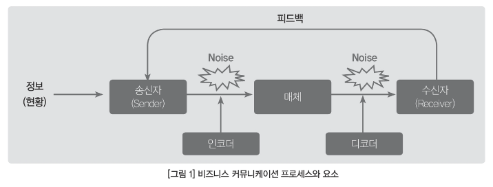
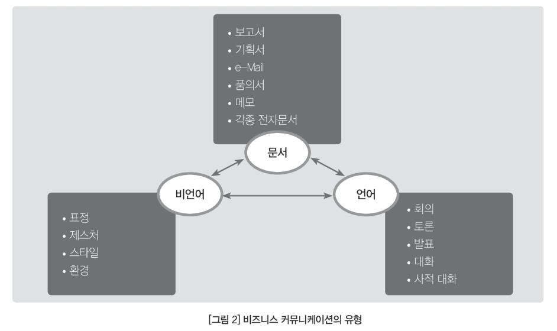
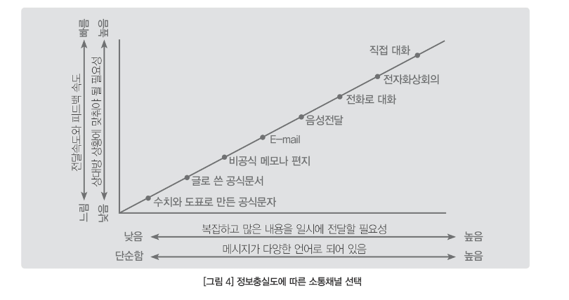

# 비즈니스 커뮤니케이션 개요

## 1. 비즈니스 커뮤니케이션 개념 및 요소

---

### 가) 비즈니스 커뮤니케이션 정의

- 어떤 일을 일정한 목적과 계획을 가지고 짜임새 있게 지속적으로 경영함
- 통상적으로 일반 기업이 하는 제반 활동
- 사업 아이테이나 사업 분야를 말하는 경우도 있음

### 나) 비즈니스 커뮤니케이션 요소

- 핵심 요소는 공유하고자 하는 정보, 송신자와 수신자, 매체이다.
- 정보를 담기 위한 인코딩, 정보를 획득하기 위한 디코딩
- 잡음(noise)가 발생할 수 있음
- 피드백 필수적

### 다) 비즈니스 커뮤니케이션 유형

- 문서
  - 문자를 사용
  - 단방향 의사전달
- 언어
  - 말을 사용
  - 실시간 피드백 가능
- 비언어
  - 표정, 목소리 등 사용
  - 이성보다는 감성에 호소
- 가장 중요한 것은 몸짓(비언어)
- 보이지 않는 부분이 매우 중요하게 의사전달에 영향을 미침

## 2. 비즈니스 커뮤니케이션 방법

- 수평적
  - 동료 사이
- 수직적
  - 상사와 부하직원 간
  - 상향식
  - 하향식

### 소통채널과 정보충실도

# 비즈니스 문제해결 기법

### 비즈니스 문제해결 프로세스

1. 문제 정의

- 문제의 인식
- 문제정의 기술

2. 원인 분석

- 프로파일링 및 분석기법 활용

3. 대인 개발 및 평가

- 평가기준 & 가중치 기반 평가

4. 해결안적용 및 피드백

- 실행 및 평가
- 피드백 및 개선

### 창의적 사고기법

1. 브레인스토밍
2. 여섯가지 생각모자

- 하얀 모자
  - 중립적으로 사실이나 데이터 설명 역할
- 빨간 모자
  - 감정적인 발상 역할
- 검은 모자
  - 부정적이거나 반대하는 역할
- 노란 모자
  - 긍정적인 역할
- 초록 모자
  - 창조적으로 새로운 아이디어를 내는 역할
- 파란 모자
  - 냉정하고 객관적으로 결과 정리 역할

1. 랜덤 워드

- 독특한 아이디어가 나올때까지 단어를 제시하고, 그 중 무작위적으로 조합하여 과제와 연결

4. 스캠퍼(SCAMPER)

- Substitute, Combine, Adapt, Modify or Magnify, Put to other side, Eliminate, Rearrange or Reverse
- 위 행위들을 해보며 아이디어 발상

5. TRIZ(Theory Of Inventive Problem Solving)

- 특정 문제를 추상화를 통해 일반화한 후, 일반적 해결 모형을 찾아 해결방안 도출

### 논리적 사고기법

1. MECE(Mutually Exclusive and Collectively Exhausive)

- 상호 중복 없이 전체적으로 빠진 것이 없는
- 어떤 정보나 메시지를 중복이나 누락 없이 구성하는 것
- 전체의 합이 모든 경우의 수를 포함하도록 처리하는 것

2. 로직트리

- MECE 사고방식에 따라 주요항목을 트리 형태로 분해한 것

3. 80:20의 법칙

- 핵심문제 20%를 해결하면 전체 문제 80%가 해결된다.
